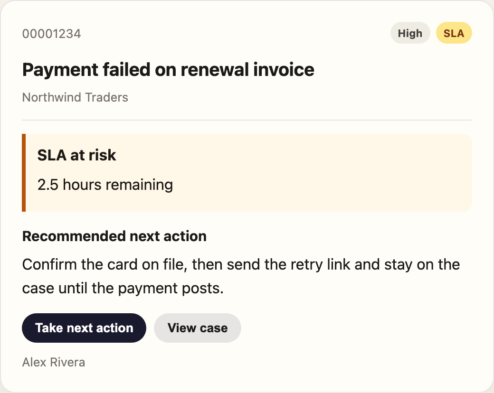
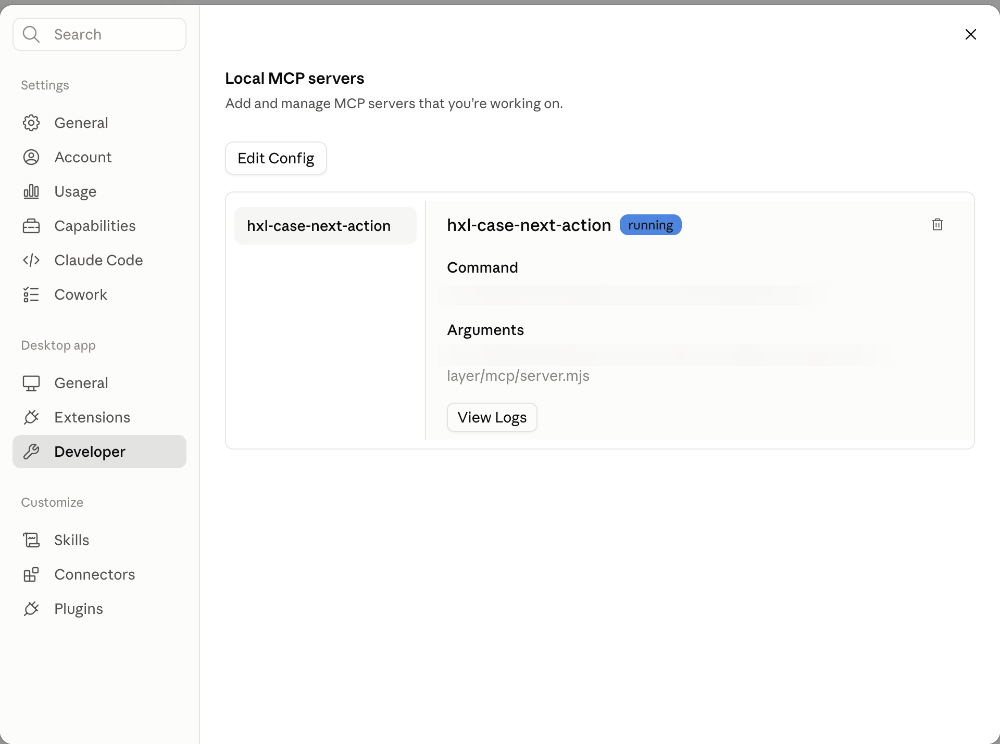

# Headless Experience Layer — Case Next Action

This repo is a public sample of Salesforce [Headless Experience Layer (HXL)](https://www.salesforce.com/headless/agentic-experience-layer/).

If those words are new, read this page as a tutorial. The [blog post](docs/blog/20260813-headless-experience-layer.html) starts from HXL beta (end of July 2026; org access early August; GA planned for Dreamforce) and how we learned it in the playground by building Case Next Action. This README is the file-by-file recipe.

**In one sentence:** we described a case card once as Mosaic JSON, then let Claude Desktop render it by calling a local tool.



Sample data is fictional (Northwind Traders, case `00001234`). Nothing here is from a customer org.

## What you need to know first

| Term | Meaning |
|---|---|
| **HXL** | Salesforce product: describe a UI once; Slack, ChatGPT, Claude, Agentforce, or any MCP host paints it. |
| **Playground** | Live editor at [Explore the Playground](https://www.headlessexperiencelayer.com/playground/). Tutorials on that site are themselves widgets. |
| **Component** | A primitive: `tile/text`, `tile/badge`, `tile/button`, `tile/card`. |
| **Widget** | Those primitives composed into one page (our card). |
| **Mosaic** | The playground JSON (`type: mosaic`, bindings `{!$case.field}`). |
| **WidgetBundle** | The org-shaped copy (`lightning__agentforceWidget`, bindings `{!$attrs.field}`, plus `schema.json`). |
| **MCP** | [Model Context Protocol](https://modelcontextprotocol.io/). A local server Claude can start and call. |
| **Claude Desktop** | The chat app. This demo is **not** Claude Code in the terminal. |
| **stdio** | How Desktop talks to our server: it launches `node mcp/server.mjs` itself. No extra terminal. |

You do not pick hex colors in HXL. You pick **semantic variants** (`primary`, `warning`, `elevated`). Each host maps those to its own look.

## What is in this repo

| Path | Role |
|---|---|
| `mosaics/case-next-action.json` | Playground Mosaic. Paste this into the playground. |
| `mosaics/hello-world.json` | Smallest possible widget (`tile/text`). |
| `force-app/main/default/uiWidgets/caseNextAction/` | WidgetBundle for a Salesforce org (optional for Claude). |
| `mcp/server.mjs` | MCP server. Tool: `get_case_next_action`. |
| `mcp/widgets/case-next-action.html` | HTML the host iframes after the tool runs. |
| `preview/` | Local semantic preview (not a pixel-perfect host). |
| `docs/blog/20260813-headless-experience-layer.html` | What HXL is, when it shipped, how we learned it. |
| `scripts/validate-widget.py` | Checks the WidgetBundle against authoring rules. |

## Step 1 — Develop the HXL component

1. Open the [HXL Playground](https://www.headlessexperiencelayer.com/playground/).
2. Start from a tutorial (each lesson is a widget) or a blank mosaic.
3. Build a tree of tiles. Ours is: `tile/column` → `tile/card` → header row, subject, customer, optional SLA callout, recommended action, two buttons.
4. Bind data with `{!$case.field}` and an inline `dataProviders` block. Example from `mosaics/case-next-action.json`:

```json
{
  "definition": "tile/callout",
  "meta": { "if": "{!$case.slaAtRisk}" },
  "attributes": { "variant": "warning", "title": "SLA at risk" }
}
```

When `slaAtRisk` is false, that callout is **not in the tree**. Do not hide it with CSS.

5. Switch host previews (Slack / ChatGPT / Claude / Agentforce). If it only looks right on one surface, the variants are too specific.
6. Save the JSON as `mosaics/case-next-action.json`.

Local preview of the same idea (file:// may block `fetch`):

```bash
python3 -m http.server 8766
# http://127.0.0.1:8766/preview/
```

## Step 2 — Keep a WidgetBundle (org shape)

Claude does not need this. A Salesforce org does.

Same tiles, different envelope:

| Playground Mosaic | WidgetBundle |
|---|---|
| `type: mosaic` | `type: lightning__agentforceWidget` |
| root `tile/mosaic` | root `tile/widget` |
| `{!$case.field}` | `{!$attrs.field}` |
| inline sample data | `schema.json` types the attributes |

Three files in `force-app/main/default/uiWidgets/caseNextAction/`:

- `caseNextAction.json` — the widget body
- `schema.json` — attribute types (`lightning__textType`, `lightning__booleanType`, …)
- `caseNextAction.uiwidget-meta.xml` — label, description, `widgetType` JSON

Validate:

```bash
python3 scripts/validate-widget.py
```

This repo does **not** deploy the bundle to an org. Deploy only when you intend to.

## Step 3 — Develop the MCP app

Claude chat will not load Mosaic JSON by itself. It calls a **tool**. The MCP app is that tool plus a UI resource.

```bash
cd mcp
npm install
```

What `mcp/server.mjs` does:

1. Starts an MCP server named `hxl-case-next-action` over **stdio**.
2. Registers resource `ui://widgets/case-next-action.html` (MIME `text/html;profile=mcp-app`).
3. Registers tool `get_case_next_action`. The tool returns JSON. The host fetches the HTML and puts it in an iframe.
4. Inlines `@modelcontextprotocol/ext-apps` into the widget HTML at serve time. A CDN import fails the sandbox and looks like a spinner forever.
5. Advertises both `_meta.ui.resourceUri` and `_meta["ui/resourceUri"]` so the host can find the view.

Widget HTML lives at `mcp/widgets/case-next-action.html`. The placeholder `/*__EXT_APPS_BUNDLE__*/` is replaced when the server starts.

Do **not** put an HTTP proxy (`mcp-remote`) in front of this for Claude Desktop. Native stdio is what mounted the iframe. HTTP listed the tool and still showed a spinner.

Optional local HTML preview (not the Claude path):

```bash
node mcp/server.mjs --http
# http://127.0.0.1:8787/widget-preview
```

## Step 4 — Enable the MCP in Claude Desktop

Use the **Claude Desktop chat app**, not Claude Code.

1. `npm install` in `mcp/` (Step 3). Desktop will launch Node itself.
2. Open `~/Library/Application Support/Claude/claude_desktop_config.json` (macOS).
3. Add a **stdio** server. Use a real absolute path to `server.mjs` and a Node binary Desktop can execute:

```json
{
  "mcpServers": {
    "hxl-case-next-action": {
      "command": "node",
      "args": ["/absolute/path/to/hxl-agentic-experience-layer/mcp/server.mjs"]
    }
  }
}
```

If `node` is not on Desktop’s PATH, set `command` to the full Node path (for example `~/.local/node/bin/node`).

4. **Quit Claude with ⌘Q.** Closing the window is not enough. Reopen the app.
5. Open **Settings** (`⌘,`) → **Desktop app** → **Developer** → **Local MCP servers**.
6. Confirm `hxl-case-next-action` has a blue **running** badge.



If the list is empty: **Edit Config**, fix the JSON comma or the path, save, ⌘Q again. Logs: `~/Library/Logs/Claude/`.

**Extensions** (same Settings group) is the product name for “let Claude talk to things on this machine.” **Developer** is where you confirm this local server is running.

## Step 5 — Use it in Claude

1. Start a **new chat**. Old threads can keep a dead iframe if a turn already failed.
2. Send:

```
Show me the Case Next Action card
```

3. Allow the tool if Claude asks.
4. You should see the white card (case number, High / SLA, amber callout, **Take next action**) — not a paragraph with a spinner underneath.
5. Click **Take next action** to see the widget post back into the thread. Buttons in this sample send a chat message. They do not update Salesforce.

The usage video lives in the [blog](docs/blog/20260813-headless-experience-layer.html#sample), not again on this page.

## If you only see a spinner

| Cause | Fix |
|---|---|
| Widget HTML never completed the MCP Apps handshake | Keep the inlined `ext-apps` bundle. Do not load it from a CDN. |
| HTTP + `mcp-remote` | Use native stdio as in Step 4. |
| Stale chat | ⌘Q, new chat, ask again. The host caches widget HTML. |
| Server not running | Settings → Developer. Badge must say **running**. |

## What this repo does not do

- No org deploy.
- No company CRM data.
- No pixel styling. Hosts own the look.
- Buttons are presentational toward Salesforce. Hosts must wire a real write if they want one.

## License

MIT. Product names belong to Salesforce, Inc. and Anthropic. This is an independent sample, not an official Salesforce or Anthropic repository.
