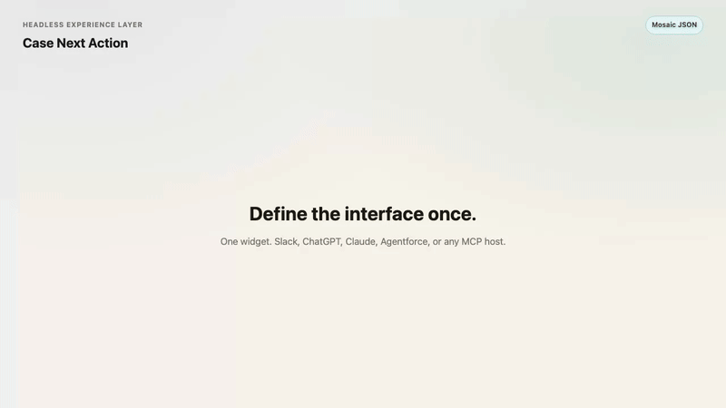

# Headless Experience Layer — Case Next Action

Public demo of Salesforce [Headless Experience Layer (HXL)](https://www.salesforce.com/headless/agentic-experience-layer/): define a UI once as Mosaic JSON, then render it natively in Slack, ChatGPT, Claude, Agentforce, or any MCP host.

This repo is the companion to the post **[Define the interface once. Render it anywhere.](docs/blog/20260813-headless-experience-layer.html)**.

## Case Next Action


<video src="docs/media/case-next-action-demo.mp4" poster="docs/media/case-next-action.png" controls muted loop playsinline width="720"></video>

[Download the demo (MP4)](docs/media/case-next-action-demo.mp4) · animated preview:



## What is in here

| Path | What it is |
|---|---|
| `mosaics/case-next-action.json` | Playground Mosaic — paste this into [Explore the Playground](https://axl-playground-tdx-f802f74fb389.herokuapp.com/) |
| `mosaics/hello-world.json` | Minimal `tile/text` widget from the playground Hello World tutorial |
| `force-app/main/default/uiWidgets/caseNextAction/` | Salesforce WidgetBundle (`lightning__agentforceWidget` + schema + meta) |
| `preview/index.html` | Local semantic preview (intent, not pixels) |
| `preview/demo.html` | Timed walkthrough used for the README recording |
| `docs/blog/` | Public blog post |
| `docs/media/` | Screenshot, GIF, and MP4 of the widget |

The playground itself is built the same way the tutorials teach: **each tutorial is a widget**. Expand the code view on any lesson to see the Mosaic tree.

## Try it

1. Open the [HXL Playground](https://axl-playground-tdx-f802f74fb389.herokuapp.com/).
2. Paste `mosaics/case-next-action.json` into the editor.
3. Switch surfaces (Slack / ChatGPT / Claude / Agentforce) and watch the same JSON re-render natively.

Local preview (file:// may block `fetch`; use a tiny static server):

```bash
python3 -m http.server 8766
# then open http://127.0.0.1:8766/preview/
```

Validate the WidgetBundle:

```bash
python3 scripts/validate-widget.py
```

Claude Code reviewed the Mosaic and WidgetBundle (13 August 2026): all six authoring checks passed (envelope, bindings, semantic variants, one primary button, boolean `meta.if`, usefulness as a next-action card). Buttons are still presentational — hosts must wire the primary action.

## Two JSON shapes, one idea

The playground speaks **Mosaic** (`type: mosaic`, `definition: tile/mosaic`, `{!$case.field}`).

A Salesforce org speaks a **WidgetBundle** (`type: lightning__agentforceWidget`, root `tile/widget`, `{!$attrs.field}` plus `schema.json`).

Same primitives (`tile/card`, `tile/badge`, `tile/button`, `meta.if`). Different envelope so the org can type-check attributes and register the bundle.

## Not in this repo

- No org deploy. Deploy WidgetBundles only when you intend to.
- No company CRM data. Sample payload is fictional (`Northwind Traders` / `00001234`).
- No pixel styling. HXL widgets express **semantic variants** (`primary`, `warning`, `elevated`) so each host applies its own look.

## License

MIT. Product names belong to Salesforce, Inc. This is an independent sample, not an official Salesforce repository.
